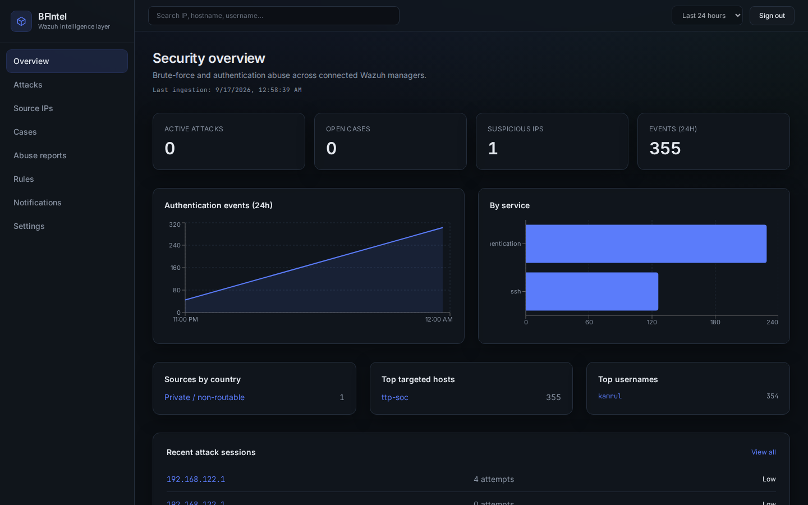
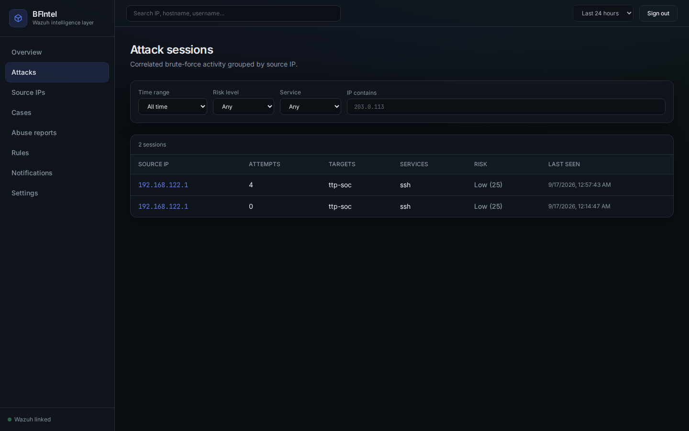
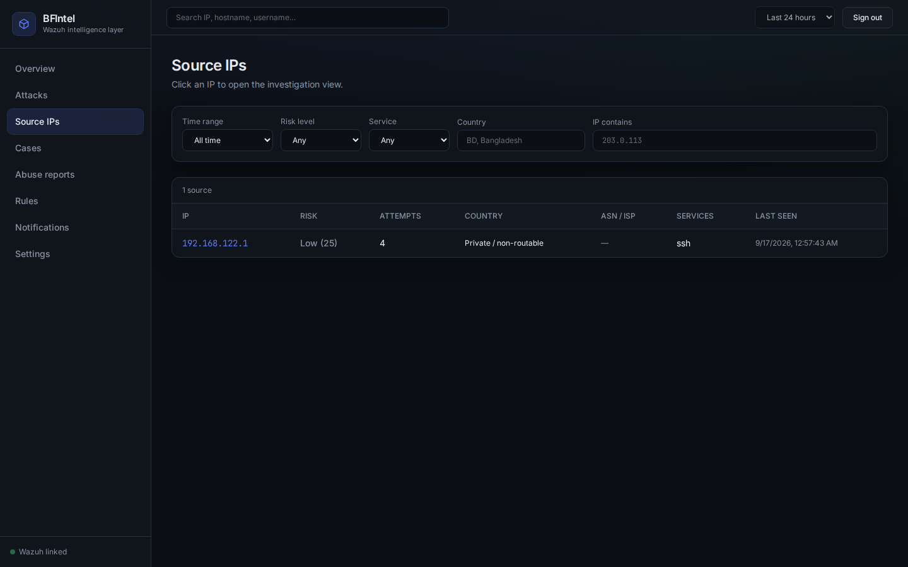
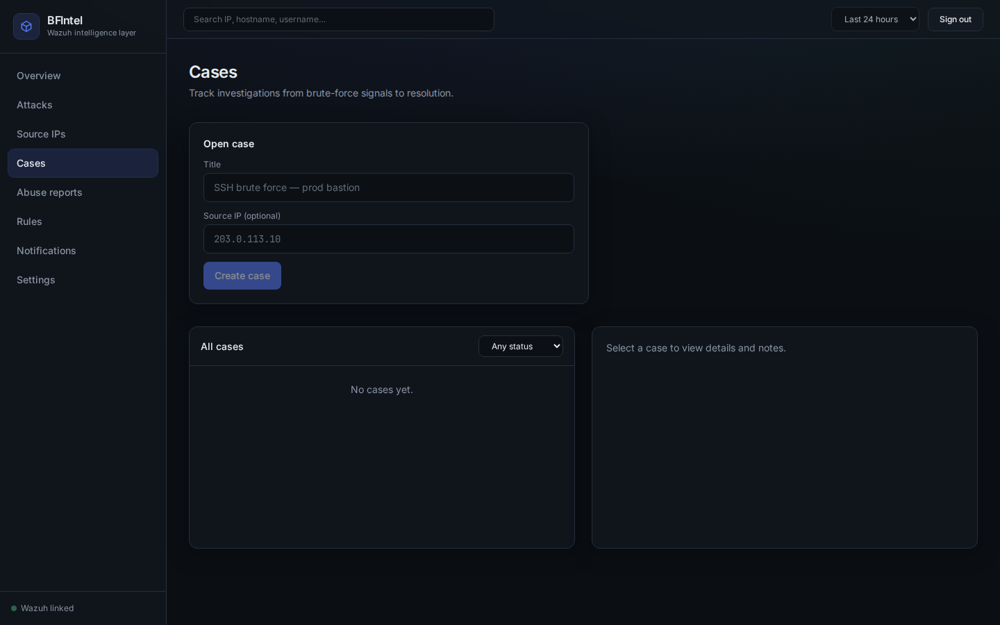
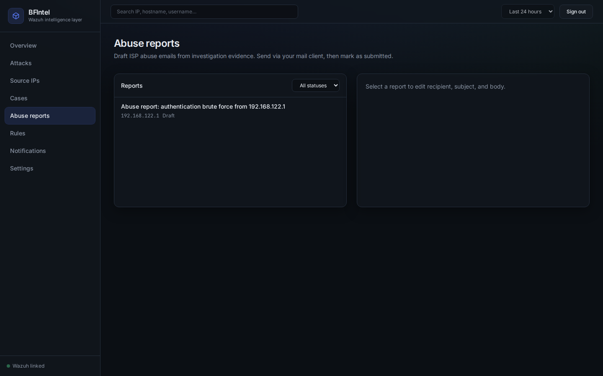
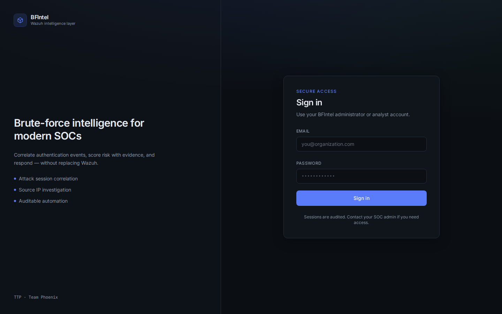

# BFIntel

[](LICENSE)

Enterprise brute-force intelligence layer for **Wazuh** — investigation, correlation, enrichment, and response (not a Wazuh replacement).



## Screenshots

| Overview | Attacks | Source IP investigation |
|----------|---------|-------------------------|
|  |  |  |

| Cases | Abuse reports | Login |
|-------|---------------|-------|
|  |  |  |

Regenerate locally (requires running instance + admin creds in env, never commit passwords):

```bash
pip install playwright && playwright install chromium
BFINTEL_URL=http://your-host:8888 BFINTEL_EMAIL=... BFINTEL_PASSWORD=... python3 scripts/capture_screenshots.py
```

## Status

| Phase | Scope | Status |
|-------|--------|--------|
| 1 | Auth, setup wizard, Docker, Wazuh connector, health | **Done (MVP)** |
| 2 | Event ingest, normalization, attack sessions, dashboard API/UI | **Done (MVP)** |
| 3 | Dashboard charts, IP table filters, investigation page, timeline, search | **Done (MVP)** |
| 4 | GeoIP/ASN/ISP enrichment, AbuseIPDB (optional), risk boost, provider UI | **Done (MVP)** |
| 5 | Automation rules, Telegram/Slack/webhook notifications, audit on execute | **Done (MVP)** |
| 6 | Cases, watch/allow/block lists, audit UI, allowlist skips rule notify | **Done (MVP)** |
| 7 | ISP abuse report drafts, templates, submit tracking, mailto workflow | **Done (MVP)** |
| 8 | Rate limits, security headers, CI, backup docs, API hardening tests | **Done (MVP)** |

## Quick start

```bash
cp .env.example .env
# Generate keys:
python3 - <<'PY'
from cryptography.fernet import Fernet
import secrets
print("FERNET_KEY=" + Fernet.generate_key().decode())
print("SECRET_KEY=" + secrets.token_hex(32))
PY

docker compose up -d --build
```

Open **http://localhost:8080** — complete setup wizard.

## Wazuh co-location

- Point the setup wizard at your manager API (e.g. `https://<wazuh-host>:55000`).
- Use the dashboard API user (e.g. `wazuh-wui`) — **never commit credentials**.
- Disable TLS verify in the wizard if using default Wazuh certificates.
- Mount `/var/ossec/logs/alerts` when BFIntel runs on the manager host — see [DEPLOYMENT.md](docs/DEPLOYMENT.md).

## Docs

- [ARCHITECTURE.md](docs/ARCHITECTURE.md)
- [SECURITY.md](docs/SECURITY.md)
- [DEPLOYMENT.md](docs/DEPLOYMENT.md)
- [BACKUP.md](docs/BACKUP.md)
- [API.md](docs/API.md)

## License

This project is licensed under the [MIT License](LICENSE) — Copyright (c) 2026 The Team Phoenix.
